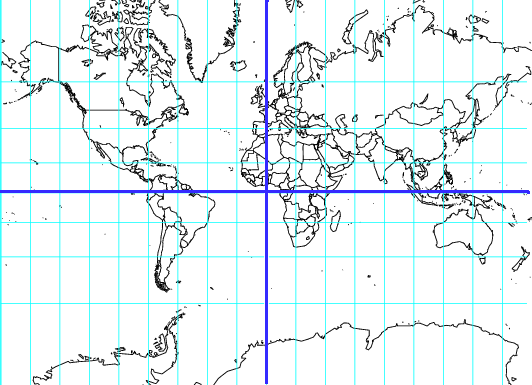
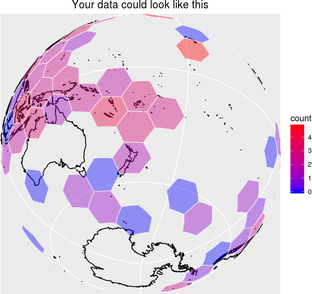

dggridR: Discrete Global Grids for R
====================================

_Spatial Analysis Done Right_

You want to do spatial statistics, and it's going to involve binning.

Binning with a rectangular grid introduces messy distortions. At the macro-scale
using a rectangular grid does things like making Greenland bigger than the
United States and Antarctica the largest continent.



But this kind of distortion is present no matter what the resolution is; in
fact, it shows up whenever you project a sphere onto a plane.

What you want are bins of equal size, regardless of where they are on the globe,
regardless of their resolution.

dggridR solves this problem.

dggridR builds discrete global grids which partition the surface of the Earth
into hexagonal, triangular, or diamond cells, **all of which have the same
size.** (There are some minor caveats which are detailed in the vignettes.)



(Naturally, you can use _much_ smaller cells than those shown in the image above.)

This package includes everything you need to make spatial binning great again.

Many details and examples are included in the vignette.


Installation
------------

dggridR is being reviewed for CRAN.

If you want it now, or prefer your code to be as up-to-date as possible, you can
install it using:

    library(devtools) #Use `install.packages('devtools')` if need be
    install_github('r-barnes/dggridR', vignette=TRUE)


Show me some code
-----------------

Okay.

Your analysis could be as easy as this:

```R
library(dggridR)
library(dplyr)

#Construct a global grid with cells approximately 1000 miles across
dggs          <- dgconstruct(spacing=1000, metric=FALSE, resround='down')

#Load included test data set
data(dgquakes)

#Get the corresponding grid cells for each earthquake epicenter (lat-long pair)
dgquakes$cell <- dgtransform(dggs,dgquakes$lat,dgquakes$lon)

#Get the number of earthquakes in each equally-sized cell
quakecounts   <- dgquakes %>% group_by(cell) %>% summarise(count=n())
```


But I want higher resolution grids than that
--------------------------------------------

Many different grid resolutions are available for many different grids. The
following chart shows the number of cells, their area, and statistics regarding
the spacing of their center nodes for the ISEA3H grid type.

|Res |Number of Cells  | Cell Area (km^2) |    Min      |     Max     |    Mean     |    Std    |
|---:|----------------:|-----------------:|------------:|------------:|------------:|----------:|
|  1 |              32 | 17,002,187.39080 | 4,156.18000 | 4,649.10000 | 4,320.49000 | 233.01400 |
|  2 |              92 |  5,667,395.79693 | 2,324.81000 | 2,692.72000 | 2,539.69000 | 139.33400 |
|  3 |             272 |  1,889,131.93231 | 1,363.56000 | 1,652.27000 | 1,480.02000 |  89.39030 |
|  4 |             812 |    629,710.64410 |   756.96100 |   914.27200 |   855.41900 |  52.14810 |
|  5 |           2,432 |    209,903.54803 |   453.74800 |   559.23900 |   494.95900 |  29.81910 |
|  6 |           7,292 |     69,967.84934 |   248.80400 |   310.69300 |   285.65200 |  17.84470 |
|  7 |          21,872 |     23,322.61645 |   151.22100 |   187.55000 |   165.05800 |   9.98178 |
|  8 |          65,612 |      7,774.20548 |    82.31100 |   104.47000 |    95.26360 |   6.00035 |
|  9 |         196,832 |      2,591.40183 |    50.40600 |    63.00970 |    55.02260 |   3.33072 |
| 10 |         590,492 |        863.80061 |    27.33230 |    35.01970 |    31.75960 |   2.00618 |
| 11 |       1,771,472 |        287.93354 |    16.80190 |    21.09020 |    18.34100 |   1.11045 |
| 12 |       5,314,412 |         95.97785 |     9.09368 |    11.70610 |    10.58710 |   0.66942 |
| 13 |      15,943,232 |         31.99262 |     5.60065 |     7.04462 |     6.11367 |   0.37016 |
| 14 |      47,829,692 |         10.66421 |     3.02847 |     3.90742 |     3.52911 |   0.22322 |
| 15 |     143,489,072 |          3.55473 |     1.86688 |     2.35058 |     2.03789 |   0.12339 |
| 16 |     430,467,212 |          1.18491 |     1.00904 |     1.30335 |     1.17638 |   0.07442 |
| 17 |   1,291,401,632 |          0.39497 |     0.62229 |     0.78391 |     0.67930 |   0.04113 |
| 18 |   3,874,204,892 |          0.13166 |     0.33628 |     0.43459 |     0.39213 |   0.02481 |
| 19 |  11,622,614,672 |          0.04389 |     0.20743 |     0.26137 |     0.22643 |   0.01371 |
| 20 |  34,867,844,012 |          0.01463 |     0.11208 |     0.14489 |     0.13071 |   0.00827 |


Credits
-------

Richard Barnes built this R package and parts of the underlying C/C++ library it
uses, though the vast majority of that is due to Kevin Sahr. Credit is also due
to John P. Snyder who worked out the advanced mathematics (which, to quote,
XKCD, may be unsuitable for liberal-arts majors) behind some of the projections.


Disclaimer
----------

This package *should* operate in the manner described here, in the package's
main documentation, and in Kevin Sahr's `dggrid` documentation. Unfortunately,
none of us are paid enough to make absolutely, doggone certain that that's the
case. That said, if you find bugs or are seeking enhancements, we want to hear
about them.


Citing this Package
-------------------

Please cite this package as:

 > Richard Barnes (2016). dggridR: Discrete Global Grids for R. https://github.com/r-barnes/dggridR.