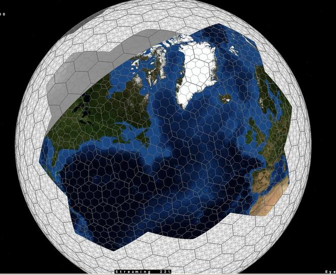
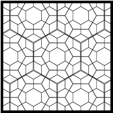

You want to do some spatial statistics, and it's going to involve binning.

You *know* that using rectangular bins is wrong, wrong, wrong because they will
require either:

- Introducing projections, which distort space
- Using a lat-long grid, which gets narrower towards the poles

What you want are bins of equal size, regardless of where they are on the globe.

dggridR solves that problem.

dggridR builds discrete global grids which partition the surface of the Earth
into hexagonal, triangular, pentagonal, or square cells, all of which have the
same size.

(Technically, since the aforementioned result is well-neigh impossible to solve,
many of these grids will also incorporate a small number of pentagons. However,
the default orientation of the grids is such that these are located over the
most inaccessible backwaters of the Earth's oceans. Future versions of this
package will better explain this limitation. (TODO))

##Notes

Many different grid resolutions are available for many different grids. The
following chart shows the number of cells, their area, and statistics regarding
the spacing of their center nodes for the ISEA3H grid type.

|Res |Number of Cells  | Cell Area (km^2) |    Min      |     Max     |    Mean     |    Std    |
|---:|----------------:|-----------------:|------------:|------------:|------------:|----------:|
|  1 |              32 | 17,002,187.39080 | 4,156.18000 | 4,649.10000 | 4,320.49000 | 233.01400 |
|  2 |              92 |  5,667,395.79693 | 2,324.81000 | 2,692.72000 | 2,539.69000 | 139.33400 |
|  3 |             272 |  1,889,131.93231 | 1,363.56000 | 1,652.27000 | 1,480.02000 |  89.39030 |
|  4 |             812 |    629,710.64410 |   756.96100 |   914.27200 |   855.41900 |  52.14810 |
|  5 |           2,432 |    209,903.54803 |   453.74800 |   559.23900 |   494.95900 |  29.81910 |
|  6 |           7,292 |     69,967.84934 |   248.80400 |   310.69300 |   285.65200 |  17.84470 |
|  7 |          21,872 |     23,322.61645 |   151.22100 |   187.55000 |   165.05800 |   9.98178 |
|  8 |          65,612 |      7,774.20548 |    82.31100 |   104.47000 |    95.26360 |   6.00035 |
|  9 |         196,832 |      2,591.40183 |    50.40600 |    63.00970 |    55.02260 |   3.33072 |
| 10 |         590,492 |        863.80061 |    27.33230 |    35.01970 |    31.75960 |   2.00618 |
| 11 |       1,771,472 |        287.93354 |    16.80190 |    21.09020 |    18.34100 |   1.11045 |
| 12 |       5,314,412 |         95.97785 |     9.09368 |    11.70610 |    10.58710 |   0.66942 |
| 13 |      15,943,232 |         31.99262 |     5.60065 |     7.04462 |     6.11367 |   0.37016 |
| 14 |      47,829,692 |         10.66421 |     3.02847 |     3.90742 |     3.52911 |   0.22322 |
| 15 |     143,489,072 |          3.55473 |     1.86688 |     2.35058 |     2.03789 |   0.12339 |
| 16 |     430,467,212 |          1.18491 |     1.00904 |     1.30335 |     1.17638 |   0.07442 |
| 17 |   1,291,401,632 |          0.39497 |     0.62229 |     0.78391 |     0.67930 |   0.04113 |
| 18 |   3,874,204,892 |          0.13166 |     0.33628 |     0.43459 |     0.39213 |   0.02481 |
| 19 |  11,622,614,672 |          0.04389 |     0.20743 |     0.26137 |     0.22643 |   0.01371 |
| 20 |  34,867,844,012 |          0.01463 |     0.11208 |     0.14489 |     0.13071 |   0.00827 |

Cells from one resolution level are partially contained by the cells of other
levels:



In future versions of this package converting from grid cells at one level to
another will be possible. (TODO)


##How do I use it?

1. Construct a discrete global grid system (dggs) object using `dgconstruct()`

2. Modify this dggs object using:
    * `dg_closest_res_to_area()`
    * `dg_closest_res_to_cls()`
    * `dg_closest_res_to_spacing()`
    * `dgsetres()`

3. Get information about your dggs object using:

    * `dggetres()`
    * `dginfo()`

4. Get the grid cells of some lat-long points with:

    * `dgtransform()`

5. Get the boundaries of the associated grid cells for use in plotting with:

    * `dgearthgrid()`
    * `dgrectgrid()`


##Examples

The following example demonstrates converting lat-long locations (the epicenters
of earthquakes) to discrete global grid locations (cell numbers), binning based
on these numbers, and plotting the result.

```{r, fig.width=5, fig.height=5}
#Include libraries
library(dggridR)
library(dplyr)

#Construct a global grid with cells approximately 1000 miles across
dggs          <- dgconstruct(spacing=1000, metric=FALSE, resround='down')

#Load included test data set
data(dgquakes)

#Get the corresponding grid cells for each earthquake epicenter (lat-long pair)
dgquakes$cell <- dgtransform(dggs,dgquakes$lat,dgquakes$lon)

#Get the number of earthquakes in each cell
quakecounts   <- dgquakes %>% group_by(cell) %>% summarise(count=n())

#Get the grid cell boundaries for the whole Earth using this dggs in a form
#suitable for plotting with ggplot2
grid          <- dgearthgrid(dggs,frame=TRUE)

#Update the grid cells' properties to include the number of earthquakes
#in each cell
grid          <- merge(grid,quakecounts,by.x="Name",by.y="cell")

#Make adjustments so the output is more visually interesting
grid$count    <- log(grid$count)
cutoff        <- quantile(grid$count,0.9)
grid          <- grid %>% mutate(count=ifelse(count>cutoff,cutoff,count))

#Polygons crossing the -180/180 degree line cause polygons will end up getting
#stretched all over the map. Let's fix that.

#Find dangerous polygons based on how many degrees of longitude they span
groups_to_wrap <- grid %>% group_by(group) %>% summarise(diff=max(long)-min(long)) %>% filter(diff>180) %>% select(group)

#Adjust them so they appear on the eastern side of the map
grid           <- grid %>% mutate(long=ifelse(group %in% groups_to_wrap$group, ifelse(long<0,long+360,long), long))

#Arrange polygon points so they are ordered appropriately, otherwise the results
#will not be nice, closed cells, but weird triangular thingies
grid           <- grid %>% arrange(group,order)

#Get polygons for each country of the world
countries <- map_data("world")
```

Okay, let's draw the plot. Notice how the hexagons appear to be all different
sizes. Really, though, they're not: that's just the effect of trying to plot a
sphere on a flat surface! And that's what would happen to your data if you
didn't use this package :-)

```{r, fig.width=6, fig.height=4}
#Plot everything on a flat map
p<- ggplot() + 
    geom_polygon(data=countries, aes(x=long, y=lat, group=group), fill=NA, color="black")   +
    geom_polygon(data=grid,      aes(x=long, y=lat, group=group, fill=count), alpha=0.4)    +
    geom_path   (data=grid,      aes(x=long, y=lat, group=group), alpha=0.4, color="white") +
    scale_fill_gradient(low="blue", high="red")
p
```

If we replot things on a sphere, it's easy to see that all of the hexagons are
the same size, as they should be. Note how they deal easily with the
longitudinal convergence towards Antarctica, as well as with crossing -180/180
degrees.

```{r, fig.width=6, fig.height=6}
#Replot on a spherical projection
p+coord_map("ortho", orientation = c(-38.49831, -179.9223, 0))+
  xlab('')+ylab('')+
  theme(axis.ticks.x=element_blank())+
  theme(axis.ticks.y=element_blank())+
  theme(axis.text.x=element_blank())+
  theme(axis.text.y=element_blank())+
  ggtitle('Your data could look like this')
```

You can also write out a KML file with your data included for displaying in,
say, Google Earth:

```{r, eval=FALSE}
library(rgdal)

#Get the grid cell boundaries for the whole Earth using this dggs in a form
#suitable for printing to a KML file
grid          <- dgearthgrid(dggs,frame=FALSE)

#Update the grid cells' properties to include the number of earthquakes
#in each cell
grid@data$count <- merge(grid@data, quakecounts, by.x="Name", by.y="cell", all.x=TRUE)$count

#Write out the grid
writeOGR(grid, "quakes_per_cell.kml", "quakes", "KML")
```


##Roadmap

In the future, I plan to switch the package from using Kevin Sahr's dggrid
software to the discrete global grid system standards currently being developed
by OpenGeospatial. Those standards are being developed by a [software working
group](http://www.opengeospatial.org/projects/groups/dggsswg) right now, but
will one day be released. At that point, I expect that GDAL/OGR/PROJ4 will
incorporate the new standards making wider interoperability possible. Until that
time, Sahr's dggrid is the best option I've found.


##Credits

This R package was developed by Richard Barnes (http://rbarnes.org).

The dggrid conversion software was developed predominantly by Kevin Sahr
[http://www.discreteglobalgrids.org](http://www.discreteglobalgrids.org), with
contributions from a few others.


##Disclaimer

This package *should* operate in the manner described here, in the package's
main documentation, and in Kevin Sahr's dggrid documentation. Unfortunately,
none of us are paid enough to make absolutely, doggone certain that that's the
case. Use at your own discretion. That said, if you find bugs or are seeking
enhancements, we want to hear about them.


##Citing this Package

Please cite this package as:

 > Richard Barnes (2016). dggridR: Discrete Global Grids for R. https://github.com/r-barnes/dggridR.