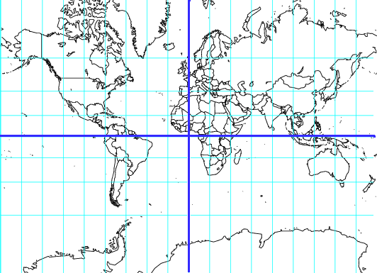
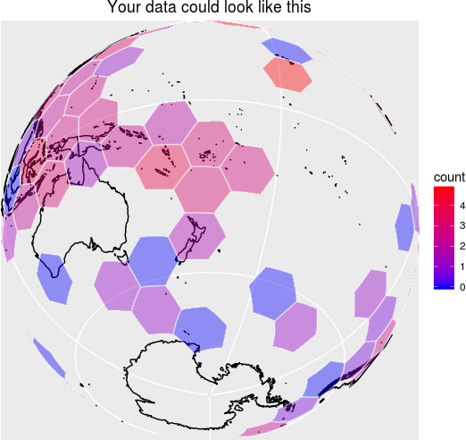
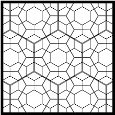

```{r, fig.width=5, fig.height=5, results='hide', warning=FALSE, error=FALSE, message=FALSE, echo=FALSE, fig.align='center'}
# Generate cover picture
library(dggridR)
library(sf)
library(ggplot2)

# Generate grids of various sizes
hgrids <- lapply(3:5, function(res) dgconstruct(res=res))
hgrids <- lapply(hgrids, function(dggs) dgearthgrid(dggs))
hgrids <- lapply(hgrids, function(x) st_wrap_dateline(x, options = c("WRAPDATELINE=YES","DATELINEOFFSET=10"), quiet = TRUE))

countries <- map_data("world")

# Crop generate dgrids to areas of interest
bounds = st_bbox(c(xmin = -90, xmax = 75, ymin = -90, ymax = 90), crs = st_crs(4326))
hgrids[[1]] = hgrids[[1]] |> st_make_valid() |> st_filter(st_as_sfc(bounds), .predicate=st_within)
bounds = st_bbox(c(xmin = 20, xmax = 145, ymin = -90, ymax = 90), crs = st_crs(4326))
hgrids[[2]] = hgrids[[2]] |> st_make_valid() |> st_filter(st_as_sfc(bounds), .predicate=st_within)
bounds = st_bbox(c(xmin = 90, xmax = 215, ymin = -90, ymax = 90), crs = st_crs(4326))
hgrids[[3]] = hgrids[[3]] |> st_make_valid() |> st_filter(st_as_sfc(bounds), .predicate=st_within)

ggplot() +
    geom_polygon(data=countries,  aes(x=long, y=lat, group=group), fill=NA, color="black")   +
    scale_fill_gradient(low="blue", high="red")+
    geom_sf(data=hgrids[[1]], fill=NA, color="#1B9E77")+
    geom_sf(data=hgrids[[2]], fill=NA, color="#D95F02")+
    geom_sf(data=hgrids[[3]], fill=NA, color="#7570B3")+
    # coord_sf(crs="+proj=ortho +lat_0=0 +lon_0=90")+
    xlab('')+ylab('')+
    theme(axis.ticks.x=element_blank())+
    theme(axis.ticks.y=element_blank())+
    theme(axis.text.x=element_blank())+
    theme(axis.text.y=element_blank())
```


# _Spatial Analysis Done Right_

You want to do spatial statistics, and it's going to involve binning.

Binning with a rectangular grid introduces messy distortions. At the macro-scale
using a rectangular grid does things like making Greenland bigger than the
United States and Antarctica the largest continent.



But this kind of distortion is present no matter what the resolution is.

What you want are bins of equal size, regardless of where they are on the globe,
regardless of their resolution.

dggridR solves this problem.

dggridR builds discrete global grids which partition the surface of the Earth
into hexagonal, triangular, or diamond cells, **all of which have the same
size.** (There are some minor details which are detailed in the [Caveats section](#caveats) below.)



This package includes everything you need to make spatial binning great again.

Many details are included in the vignette.


# Grids

The following grids are available:

 * ISEA3H:    Icosahedral Snyder Equal Area Aperture 3 Hexagonal Grid
 * ISEA4H:    Icosahedral Snyder Equal Area Aperture 4 Hexagonal Grid
 * ISEA7H:    Icosahedral Snyder Equal Area Aperture 7 Hexagonal Grid
 * ISEA43H:   Icosahedral Snyder Equal Area Mixed Aperture 4,3 Hexagonal Grid
 * ISEA4T:    Icosahedral Snyder Equal Area Aperture 4 Triangular Grid
 * ISEA4D:    Icosahedral Snyder Equal Area Aperture 4 Diamond Grid
 * FULLER3H:  Fuller Aperture 3 Hexagonal Grid
 * FULLER4H:  Fuller Aperture 4 Hexagonal Grid
 * FULLER7H:  Fuller Aperture 7 Hexagonal Grid
 * FULLER43H: Fuller Mixed Aperture 4,3 Hexagonal Grid
 * FULLER4T:  Fuller Aperture 4 Triangular Grid
 * FULLER4D:  Fuller Aperture 4 Diamond Grid

Use the `aperture` argument of `dgconstruct()` to select aperture 3, 4, or 7 for hexagonal grids.
MIXED43 grids alternate aperture-4 and aperture-3 refinements; construct them with `aperture_type = "MIXED43"` and `num_aperture_4_res` specifying how many resolution levels use aperture-4 refinement.

Unless you are using cells with very large areas (significant fractions of
Earth's hemispheres), I recommend the ISEA3H be your default grid.

This grid, along with the other Icosahedral grids ensures that all cells are of
equal area, with a notable exception. At every resolution, the Icosahedral grids
contain 12 pentagonal cells which each have an area exactly 5/6 that of the
hexagonal cells. But you don't need to worry about this too much for two
reasons. (1) As the table below shows, these cells are a small, small minority
of the total number of cells. (2) The grids are orientated so that these cells
are in out-of-the-way places. Future versions of this package will allow you to
reorient the grids, if need be. (TODO)

For more complex applications than simple spatial binning, it is necessary to
consider trade-offs between the different grids. Good references for
understanding these include [@Kimerling1999; @Gregory2008].

Users attempting multi-scale analyses should be aware that in the hexagonal
grids cells from one resolution level are partially contained by the cells of
other levels.



Use `dgchildren()` and `dgparent()` to navigate between resolution levels:
`dgchildren(dggs, cells)` returns the finer-resolution cells contained within
each input cell, and `dgparent(dggs, cells)` returns the coarser-resolution
cell that contains each input cell.


## ISEA3H Details

The following table shows the number of cells, their area, and statistics
regarding the spacing of their center nodes for the ISEA3H grid type.


|Res |Number of Cells  | Cell Area (km^2) |    Min      |     Max     |    Mean     |    Std    |
|---:|----------------:|-----------------:|------------:|------------:|------------:|----------:|
|  0 |              12 | 51,006,562.17241 |             |             |             |           |
|  1 |              32 | 17,002,187.39080 | 4,156.18000 | 4,649.10000 | 4,320.49000 | 233.01400 |
|  2 |              92 |  5,667,395.79693 | 2,324.81000 | 2,692.72000 | 2,539.69000 | 139.33400 |
|  3 |             272 |  1,889,131.93231 | 1,363.56000 | 1,652.27000 | 1,480.02000 |  89.39030 |
|  4 |             812 |    629,710.64410 |   756.96100 |   914.27200 |   855.41900 |  52.14810 |
|  5 |           2,432 |    209,903.54803 |   453.74800 |   559.23900 |   494.95900 |  29.81910 |
|  6 |           7,292 |     69,967.84934 |   248.80400 |   310.69300 |   285.65200 |  17.84470 |
|  7 |          21,872 |     23,322.61645 |   151.22100 |   187.55000 |   165.05800 |   9.98178 |
|  8 |          65,612 |      7,774.20548 |    82.31100 |   104.47000 |    95.26360 |   6.00035 |
|  9 |         196,832 |      2,591.40183 |    50.40600 |    63.00970 |    55.02260 |   3.33072 |
| 10 |         590,492 |        863.80061 |    27.33230 |    35.01970 |    31.75960 |   2.00618 |
| 11 |       1,771,472 |        287.93354 |    16.80190 |    21.09020 |    18.34100 |   1.11045 |
| 12 |       5,314,412 |         95.97785 |     9.09368 |    11.70610 |    10.58710 |   0.66942 |
| 13 |      15,943,232 |         31.99262 |     5.60065 |     7.04462 |     6.11367 |   0.37016 |
| 14 |      47,829,692 |         10.66421 |     3.02847 |     3.90742 |     3.52911 |   0.22322 |
| 15 |     143,489,072 |          3.55473 |     1.86688 |     2.35058 |     2.03789 |   0.12339 |
| 16 |     430,467,212 |          1.18491 |     1.00904 |     1.30335 |     1.17638 |   0.07442 |
| 17 |   1,291,401,632 |          0.39497 |     0.62229 |     0.78391 |     0.67930 |   0.04113 |
| 18 |   3,874,204,892 |          0.13166 |     0.33628 |     0.43459 |     0.39213 |   0.02481 |
| 19 |  11,622,614,672 |          0.04389 |     0.20743 |     0.26137 |     0.22643 |   0.01371 |
| 20 |  34,867,844,012 |          0.01463 |     0.11208 |     0.14489 |     0.13071 |   0.00827 |

Table: ISEA3H grid cell characteristics.


# How do I use it?

1. Construct a discrete global grid system (dggs) object using `dgconstruct()`

2. Get information about your dggs object using:

    * `dggetres()`
    * `dginfo()`
    * `dgmaxcell()`

4. Get the grid cells of some lat-long points with:

    * `dgGEO_to_SEQNUM()`
    * One of many, many other such functions

5. Get the boundaries of the associated grid cells for use in plotting with:

    * `dgcellstogrid()`
    * `dgearthgrid()`
    * `dgrectgrid()`
    * `dgshptogrid()`

6. Aggregate points directly into grid cells with:

    * `dgpoints_to_cells()` — returns an sf grid with optional per-cell counts
    * `dgbin_points()` — returns a data frame with per-cell counts, means, or totals

7. Query spatial relationships between cells with:

    * `dgneighbors()` — adjacent cells (hexagonal grids only)
    * `dgchildren()` — cells at the next finer resolution contained within each cell
    * `dgparent()` — cell at the next coarser resolution that contains each cell

8. Check that your dggs object is valid (if you've mucked with it) using:

    * `dgverify()`


# Examples

## Binning Lat-Long Points

The following example demonstrates converting lat-long locations (the
epicenters of earthquakes) to discrete global grid locations (cell numbers), binning based on these numbers, and plotting the result. Additionally, the
example demonstrates how to get the center coordinates of the cells.

```{r, results='hide', warning=FALSE, error=FALSE, message=FALSE}
#Include libraries
library(dggridR)
library(collapse)

#Construct a global grid with cells approximately 1000 miles across
dggs          <- dgconstruct(spacing=1000, metric=FALSE, resround='down')

#Load included test data set
data(dgquakes)

#Get the corresponding grid cells for each earthquake epicenter (lat-long pair)
dgquakes$cell <- dgGEO_to_SEQNUM(dggs,dgquakes$lon,dgquakes$lat)$seqnum

#Converting SEQNUM to GEO gives the center coordinates of the cells
cellcenters   <- dgSEQNUM_to_GEO(dggs,dgquakes$cell)

#Get the number of earthquakes in each cell
quakecounts   <- dgquakes |> fcount(cell, name = "count")

#Get the grid cell boundaries for cells which had quakes
grid          <- dgcellstogrid(dggs,quakecounts$cell)

#Update the grid cells' properties to include the number of earthquakes
#in each cell
grid          <- merge(grid,quakecounts,by.x="seqnum",by.y="cell")

#Make adjustments so the output is more visually interesting
grid$count    <- log(grid$count)
cutoff        <- fquantile(grid$count, 0.9)
grid          <- grid |> fmutate(count = ifelse(count>cutoff,cutoff,count))

#Get polygons for each country of the world
countries <- map_data("world")
```

Okay, let's draw the plot. Notice how the hexagons appear to be all different
sizes. Really, though, they're not: that's just the effect of trying to plot a
sphere on a flat surface! And that's what would happen to your data if you
didn't use this package :-)

```{r, fig.width=6, fig.height=4}
#Plot everything on a flat map

# Handle cells that cross 180 degrees
wrapped_grid = st_wrap_dateline(grid, options = c("WRAPDATELINE=YES","DATELINEOFFSET=180"), quiet = TRUE)

ggplot() +
    geom_polygon(data=countries, aes(x=long, y=lat, group=group), fill=NA, color="black")   +
    geom_sf     (data=wrapped_grid, aes(fill=count), color=alpha("white", 0.4)) +
    geom_point  (aes(x=cellcenters$lon_deg, y=cellcenters$lat_deg)) +
    scale_fill_gradient(low="blue", high="red")
```

<!--

If we replot things on a sphere, it's easy to see that all of the hexagons are
the same size, as they should be. Note how they deal easily with the
longitudinal convergence towards Antarctica, as well as with crossing -180/180
degrees.

```{r, fig.width=6, fig.height=6, echo=FALSE, results='hide'}
#Replot on a spherical projection
ggplot() +
    geom_polygon(data=countries, aes(x=long, y=lat, group=group), fill=NA, color="black")   +
    geom_sf     (data=grid, aes(fill=count), color=alpha("white", 0.4)) +
    geom_point  (aes(x=cellcenters$lon_deg, y=cellcenters$lat_deg)) +
    scale_fill_gradient(low="blue", high="red") +
    # coord_sf(crs="+proj=ortho +lat_0=20 +lon_0=90")+
    xlab('')+ylab('')+
    theme(axis.ticks.x=element_blank())+
    theme(axis.ticks.y=element_blank())+
    theme(axis.text.x=element_blank())+
    theme(axis.text.y=element_blank())+
    ggtitle('Your data could look like this')
```

-->

You can also write out a KML file with your data included for displaying in,
say, Google Earth:

```{r, eval=FALSE}
library(sf)

#Get the grid cell boundaries for the whole Earth using this dggs in a form
#suitable for printing to a KML file
grid <- dgearthgrid(dggs)

#Update the grid cells' properties to include the number of earthquakes
#in each cell
grid$count <- merge(grid, quakecounts, by.x="seqnum", by.y="cell", all.x=TRUE)

#Write out the grid
st_write(grid, "quakes_per_cell.kml", layer="quakes", driver="KML")
```


## Randomly Sampling the Earth: Method 1

Say you want to sample `N` areas of equal size uniformly distributed on the
Earth. dggridR provides two possible ways to accomplish this. The conceptually
simplest is to choose `N` uniformly distributed lat-long pairs and retrieve
their associated grid cells:

```{r, results='hide', warning=FALSE, error=FALSE, message=FALSE}
#Include libraries
library(dggridR)

N <- 100    #How many cells to sample

#Distribute the points uniformly on a sphere using equations from
#http://mathworld.wolfram.com/SpherePointPicking.html
u     <- runif(N)
v     <- runif(N)
theta <- 2*pi*u      * 180/pi
phi   <- acos(2*v-1) * 180/pi
lon   <- theta-180
lat   <- phi-90

df    <- data.frame(lat=lat,lon=lon)

#Construct a global grid in which every hexagonal cell has an area of
#100,000 miles^2. You could, of course, choose a much smaller value, but these
#will show up when I map them later.

#Note: Cells can only have certain areas, the `dgconstruct()` function below
#will tell you which area is closest to the one you want. You can also round
#up or down.

#Note: 12 cells are actually pentagons with an area 5/6 that of the hexagons
#But, with millions and millions of hexes, you are unlikely to choose one
#Future versions of the package will make it easier to reject the pentagons
dggs    <- dgconstruct(area=100000, metric=FALSE, resround='nearest')

#Get the corresponding grid cells for each randomly chosen lat-long
df$cell <- dgGEO_to_SEQNUM(dggs,df$lon,df$lat)$seqnum

#Get the hexes for each of these cells
gridfilename <- dgcellstogrid(dggs,df$cell)
```

The resulting distribution of cells appears as follows:

```{r, fig.width=6, fig.height=4}
#Get the grid in a more convenient format
grid <- dgcellstogrid(dggs,df$cell)
grid <- st_wrap_dateline(grid, options = c("WRAPDATELINE=YES","DATELINEOFFSET=180"), quiet = TRUE)

#Get polygons for each country of the world
countries <- map_data("world")

#Plot everything on a flat map
p <- ggplot() +
    geom_polygon(data=countries, aes(x=long, y=lat, group=group), fill=NA, color="black")   +
    geom_sf(data=grid, fill=alpha("green", alpha=0.4), color=alpha("white", alpha=0.4))
p
```


## Randomly Sampling the Earth: Method 2

Say you want to sample `N` areas of equal size uniformly distributed on the
Earth. dggridR provides two possible ways to accomplish this. The easiest way to
do this is to note that grid cells are labeled from 1 to `M`, where `M` is the
largest cell id at the resolution in question. Therefore, we can sample cell ids
and generate a grid accordingly.

```{r, results='hide', warning=FALSE, error=FALSE, message=FALSE}
#Include libraries
library(dggridR)

N <- 100    #How many cells to sample

#Construct a global grid in which every hexagonal cell has an area of
#100,000 miles^2. You could, of course, choose a much smaller value, but these
#will show up when I map them later.

#Note: Cells can only have certain areas, the `dgconstruct()` function below
#will tell you which area is closest to the one you want. You can also round
#up or down.

#Note: 12 cells are actually pentagons with an area 5/6 that of the hexagons
#But, with millions and millions of hexes, you are unlikely to choose one
#Future versions of the package will make it easier to reject the pentagons
dggs    <- dgconstruct(area=100000, metric=FALSE, resround='nearest')

maxcell <- dgmaxcell(dggs)                     #Get maximum cell id
cells   <- sample(1:maxcell, N, replace=FALSE) #Choose random cells
grid    <- dgcellstogrid(dggs,cells)           #Get grid
```

The resulting distribution of cells appears as follows:

```{r, fig.width=6, fig.height=4}
#Get the grid in a more convenient format
grid <- dgcellstogrid(dggs,df$cell)
grid <- st_wrap_dateline(grid, options = c("WRAPDATELINE=YES","DATELINEOFFSET=180"), quiet = TRUE)

#Get polygons for each country of the world
countries <- map_data("world")

#Plot everything on a flat map
p <- ggplot() +
    geom_polygon(data=countries, aes(x=long, y=lat, group=group), fill=NA, color="black")   +
    geom_sf(data=grid, fill=alpha("green", 0.4), color=alpha("white", 0.4))
p
```


## Save a grid for use in other software

Sometimes you want to use a grid in software other than R. To facilitate this,
the grid generation commands include the `savegrid` argument, as demonstrated
below.

```{r, results='hide', warning=FALSE, error=FALSE, message=FALSE}
library(dggridR)
#Generate a global grid whose cells are ~100,000 miles^2
dggs         <- dgconstruct(area=100000, metric=FALSE, resround='nearest')
#Save the cells to a KML file for use in other software
gridfilename <- dgearthgrid(dggs,savegrid=tempfile())
```

## Get a grid that covers South Africa
```{r, results='hide', warning=FALSE, error=FALSE, message=FALSE, fig.align='center', fig.width=5, fig.height=5}
library(dggridR)

#Generate a dggs specifying an intercell spacing of ~25 miles
dggs      <- dgconstruct(spacing=100, metric=FALSE, resround='nearest')

#Read in the South Africa's borders from the shapefile
sa_border <- st_read(dg_shpfname_south_africa(), layer="ZAF_adm0")
st_crs(sa_border) = 4326

#Get a grid covering South Africa
sa_grid   <- dgshptogrid(dggs, dg_shpfname_south_africa())

#Plot South Africa's borders and the associated grid
p <- ggplot() +
    geom_sf(data=sa_border, fill=NA, color="black")   +
    geom_sf(data=sa_grid, fill=alpha("blue", 0.4), color=alpha("white", 0.4))
p
```


## Point Aggregation

`dgpoints_to_cells()` maps a set of lon/lat points to their grid cells and
returns the grid geometry as an sf object, optionally with a `count` column
showing how many points fell in each cell. `dgbin_points()` skips the geometry
and returns a plain data frame of per-cell statistics (count, mean, total).

```{r, results='hide', warning=FALSE, error=FALSE, message=FALSE}
library(dggridR)

data(dgquakes)
dggs <- dgconstruct(spacing = 1000, metric = FALSE, resround = 'down')

# One step: points → sf grid with per-cell counts
grid <- dgpoints_to_cells(dggs, dgquakes$lon, dgquakes$lat, return_count = TRUE)
grid$count <- log(grid$count)

countries <- map_data("world")
wrapped   <- st_wrap_dateline(grid, options = c("WRAPDATELINE=YES","DATELINEOFFSET=180"), quiet = TRUE)
```

```{r, fig.width=6, fig.height=4}
ggplot() +
    geom_polygon(data=countries, aes(x=long, y=lat, group=group), fill=NA, color="black") +
    geom_sf(data=wrapped, aes(fill=count), color=alpha("white", 0.4)) +
    scale_fill_gradient(low="blue", high="red") +
    ggtitle("Earthquakes per cell (log scale)")
```

`dgbin_points()` is useful when you only need the aggregated numbers rather than
the geometry:

```{r}
bins <- dgbin_points(dggs, dgquakes$lon, dgquakes$lat, output_count = TRUE)
head(bins)
```


## Grid Neighbours

`dgneighbors()` returns the 6 adjacent cells for each hexagonal cell (not
supported for triangular grids).

```{r, results='hide', warning=FALSE, error=FALSE, message=FALSE}
library(dggridR)

dggs <- dgconstruct(res = 2, show_info = FALSE)

center_cell <- 50
nbrs <- dgneighbors(dggs, center_cell)

# Visualise the cell and its ring of neighbours
all_cells <- c(center_cell, nbrs$neighbor)
grid      <- dgcellstogrid(dggs, all_cells)
grid$role <- ifelse(grid$seqnum == center_cell, "centre", "neighbour")
```

```{r, fig.width=5, fig.height=4}
ggplot() +
    geom_sf(data=grid, aes(fill=role), color="white") +
    scale_fill_manual(values = c(centre = "#E41A1C", neighbour = "#377EB8")) +
    ggtitle(paste("Cell", center_cell, "and its 6 neighbours"))
```


## Parent and Child Cells

`dgchildren()` returns the cells at the next finer resolution that are contained
within each input cell. `dgparent()` returns the coarser-resolution cell that
contains each input cell. Both require a hexagonal grid.

```{r, results='hide', warning=FALSE, error=FALSE, message=FALSE}
library(dggridR)

dggs_parent <- dgconstruct(res = 3, show_info = FALSE)
dggs_child  <- dgconstruct(res = 4, show_info = FALSE)

parent_cell <- 100
chld <- dgchildren(dggs_parent, parent_cell)

# Visualise the parent boundary and its child cells
grid_parent <- dgcellstogrid(dggs_parent, parent_cell)
grid_child  <- dgcellstogrid(dggs_child, chld$child)
```

```{r, fig.width=5, fig.height=4}
ggplot() +
    geom_sf(data=grid_child,  fill=alpha("#377EB8", 0.5), color="white") +
    geom_sf(data=grid_parent, fill=NA, color="#E41A1C", linewidth=1.2) +
    ggtitle(paste("Children of cell", parent_cell, "at res 4 (red = parent boundary)"))
```

Round-tripping via `dgparent()` confirms that interior children map back to
their parent (boundary children may be shared with a neighbouring cell):

```{r}
prnt <- dgparent(dggs_child, chld$child)
head(prnt)
```


## Densification

The `densify` parameter in `dgearthgrid()` and `dgcellstogrid()` inserts
additional interpolated vertices along each cell edge. The default (`densify=0`)
uses only the corner vertices; higher values add intermediate points and produce
smoother curves when the cells are displayed in a curved projection.

```{r, results='hide', warning=FALSE, error=FALSE, message=FALSE}
library(dggridR)

dggs <- dgconstruct(res = 2, show_info = FALSE)
g0   <- dgearthgrid(dggs, densify = 0)  # corners only
g5   <- dgearthgrid(dggs, densify = 5)  # 5 extra vertices per edge
```

```{r}
# Vertex counts increase substantially with densification
c(
  sparse = sum(lengths(lapply(sf::st_geometry(g0), sf::st_coordinates))),
  dense  = sum(lengths(lapply(sf::st_geometry(g5), sf::st_coordinates)))
)
```


## Random Grid Orientation

By default the 12 pentagonal cells are placed at fixed, out-of-the-way
locations. Pass `orient = "RANDOM"` to `dgconstruct()` for a uniformly random
icosahedral orientation, which is useful for sensitivity analyses or Monte Carlo
studies. Use `set.seed()` before the call for reproducibility.

```{r, results='hide', warning=FALSE, error=FALSE, message=FALSE}
library(dggridR)

set.seed(42)
dggs_r <- dgconstruct(res = 3, orient = "RANDOM", show_info = FALSE)
gr     <- dgearthgrid(dggs_r)
```

```{r, fig.width=6, fig.height=4}
countries <- map_data("world")
ggplot() +
    geom_polygon(data=countries, aes(x=long, y=lat, group=group), fill=NA, color="black") +
    geom_sf(data=gr, fill=NA, color=alpha("#1B9E77", 0.5)) +
    ggtitle("ISEA3H res-3 grid with random orientation (set.seed(42))")
```


# Caveats

At every resolution, the Icosahedral grids contain 12 pentagonal cells which
each have an area exactly 5/6 that of the hexagonal cells. In the standard
orientation, these are located as follows (scaled to a size corresponding to the
grid resolution):

```{r, results='hide', warning=FALSE, error=FALSE, message=FALSE, fig.align='center', fig.width=6, fig.height=4, echo=FALSE}

lat <- c(90,-90,26.57,-26.57,26.57,-26.57,26.57,-26.57,26.57,-26.57,26.57,-26.57)
lon <- c(0,0,0,36,72,108,144,180,216,252,288,324)

dggs  <- dgconstruct(area=100000, metric=FALSE, resround='nearest')
cells <- dgGEO_to_SEQNUM(dggs,lon,lat)$seqnum
grid  <- dgcellstogrid(dggs,cells) #Get grid
grid  <- st_wrap_dateline(grid, options = c("WRAPDATELINE=YES","DATELINEOFFSET=180"), quiet = TRUE)

#Get polygons for each country of the world
countries <- map_data("world")

#Plot everything on a flat map
p <- ggplot() +
    geom_polygon(data=countries, aes(x=long, y=lat, group=group), fill=NA, color="black")   +
    geom_sf(data=grid, fill=alpha("purple", 0.6), color=alpha("white", 0.4))
p
```


# Roadmap

* In the future, I plan to switch the package from using Kevin Sahr's dggrid
software to the [discrete global grid system standards currently being developed
by OpenGeospatial](https://docs.ogc.org/is/21-038r1/21-038r1.html).

<!-- Those standards are being developed by a [software working
group](https://www.ogc.org/projects/groups/dggsswg/) right now, but
will one day be released. At that point, I expect that GDAL/OGR/PROJ4 will
incorporate the new standards making wider interoperability possible. Until that
time, Sahr's dggrid is the best option I've found. -->


# Credits

This R package was originally developed by Richard Barnes (https://rbarnes.org/) and is currently maintained by Sebastian Krantz.

The dggrid conversion software was developed predominantly by Kevin Sahr
(https://github.com/sahrk/DGGRID), with contributions from a few others.

Large portions of the above documentation are drawn from the DGGRID version 9.0b
User Documentation, which is available at the DGGRID repository.


# Disclaimer

This package *should* operate in the manner described here, in the package's
main documentation, and in Kevin Sahr's dggrid documentation. Unfortunately,
none of us are paid enough to make absolutely, doggone certain that that's the
case. Use at your own discretion. That said, if you find bugs or are seeking
enhancements, we want to hear about them.


# Citing this Package

Please cite this package as:

 > Sebastian Krantz, Richard Barnes, and Kevin Sahr (2026). dggridR: Discrete Global Grids for R. R package version 4.1.0. "https://github.com/r-barnes/dggridR/" \doi{10.5281/zenodo.1322866}


# References
